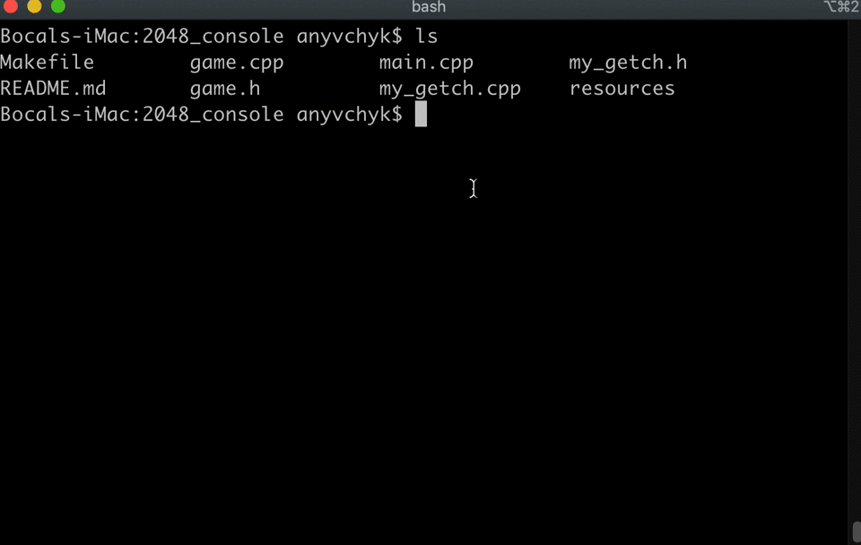

## 2048 console game

### History
[When I was younger, so much younger then today](https://youtu.be/2Q_ZzBGPdqE?t=10), I've decided to implement a classical 2048 game in a console.

I've done it using C++ and my little knowledge in it.

But anyway I love this project, beacuse it reminds me about my passion for games and programming.

### Requirements and dependencies
* Unix-like system
* g++ -std=c++11
* Make

### How to run
* Clone this repository `git clone https://github.com/Zhivch1k/2048_console.git`
* Enter its directory `cd 2048_console`
* Run `make` command
* Run a game `./2048`

### Screenshots

